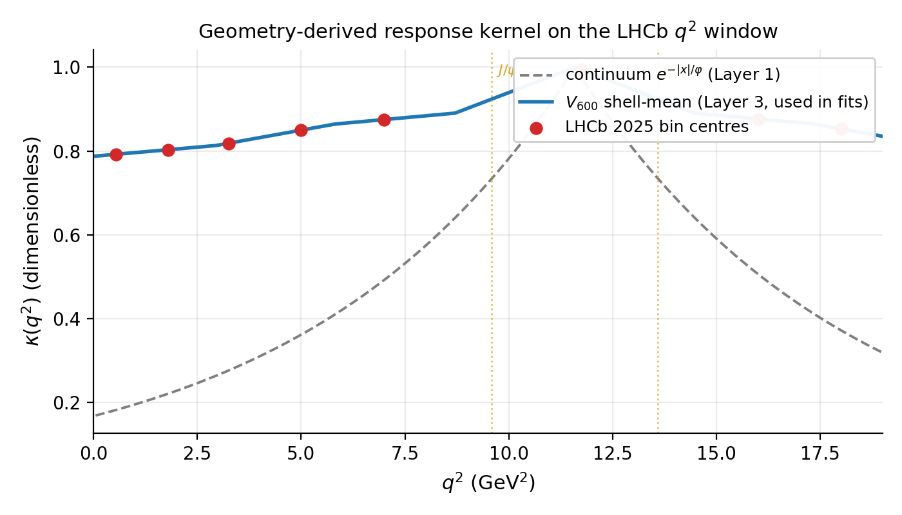
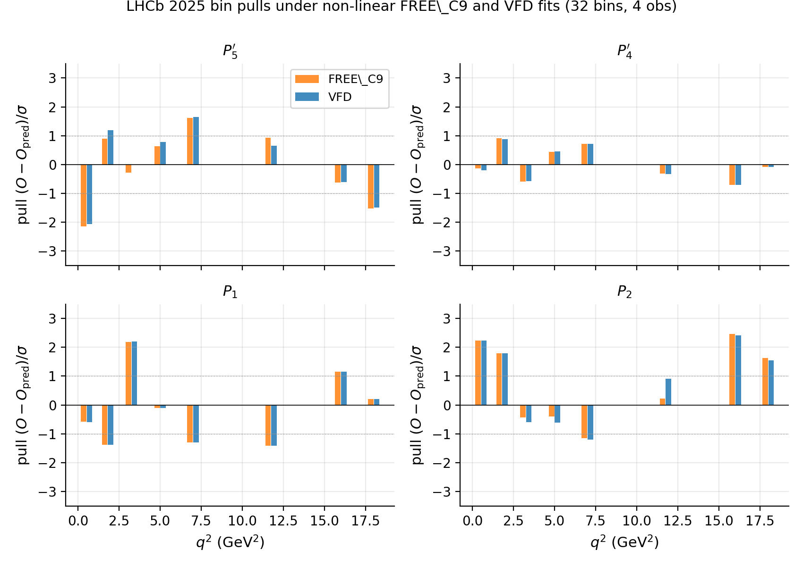
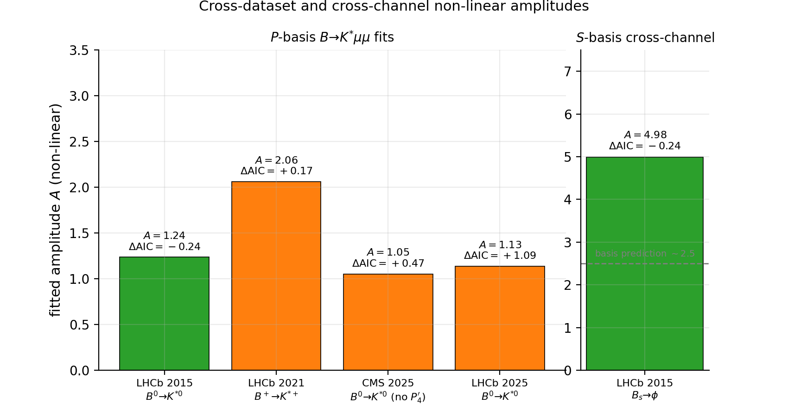

# vfd-b-anomaly

**A geometry-derived response kernel for the $B \to K^{*}\mu^{+}\mu^{-}$ angular anomaly: sign-uniform cross-dataset and cross-channel fit.**

[](LICENSE)
[](paper/main.pdf)

This repository accompanies the preprint **[paper/main.pdf](paper/main.pdf)**. It contains all source code, processed data, intermediate result tables, and figures needed to reproduce every number in the paper from a clean checkout.

---

## Headline result (non-linear refit, the paper's published headline)

A single $q^{2}$-dependent response kernel $\kappa(q^{2})$, built from the 600-cell $V_{600}$ graph regularised by the golden ratio $\varphi^{-2}$ as a discrete mass scale, is fitted to five public flavour-physics datasets covering two collaborations, two isospin partners, and two decay channels. Predictions are evaluated using `flavio.np_prediction` directly (no Taylor expansion in $\Delta C_{9}$).

| dataset | decay | $n$ | non-linear $\Delta\mathrm{AIC}$ | best-fit $A$ | $\Delta C_{9}^{\mathrm{eff}}$ |
|---|---|---:|---:|---:|---:|
| LHCb 2015            | $B^{0}\!\to\!K^{*0}$           | 32 | $-0.24$ | $+1.24$ | $-0.96$ |
| LHCb 2021            | $B^{+}\!\to\!K^{*+}$           | 32 | $+0.17$ | $+2.06$ | $-1.59$ |
| CMS 2025 (no $P_{4}'$) | $B^{0}\!\to\!K^{*0}$           | 18 | $+0.47$ | $+1.05$ | $-0.81$ |
| LHCb 2025            | $B^{0}\!\to\!K^{*0}$           | 32 | $+1.09$ | $+1.14$ | $-0.86$ |
| LHCb 2015            | $B_{s}\!\to\!\phi$ ($S$-basis) | 24 | $-0.24$ | $+4.98$ | $-3.85$ |

**What survives the non-linear analysis:**
- $A>0$ in **5/5** fits; $\Delta C_{9}^{\mathrm{eff}}<0$ in **5/5** fits.
- The kernel describes the $q^{2}$ shape with one parameter per dataset, no shape retuning.

**What the paper does not claim:**
- The kernel does **not** beat a constant Wilson-coefficient shift on AIC. The stacked Akaike weight across all five fits is $w_{\mathrm{VFD}} = 0.348$ vs $w_{\mathrm{FREE\_C9}} = 0.652$ (a mild $\sim 1.9{:}1$ preference for the constant shift).
- A free-width Gaussian charm-loop proxy fits comparably at the cost of one extra parameter.
- An earlier linearised analysis (the project's "Mode B") found a stronger result ($\Delta\mathrm{AIC}=-1.67$ in favour of the kernel on LHCb 2025) that **did not survive the non-linear refit**. The drift of $+2.77$ AIC units is the largest single uncertainty in the project. See §2 and §4 of [the paper](paper/main.pdf) and [`reports/wo016c_nonlinear_refit.md`](reports/wo016c_nonlinear_refit.md).

The earlier linearised numbers are retained in the paper as a methodology diagnostic.

---

## Figures from the paper

| | |
|---|---|
|  |  |
| **F1** Geometry-derived kernel $\kappa(q^{2})$ on the LHCb $q^{2}$ window. Solid blue: discrete $V_{600}$ shell-mean (Layer 3, used in fits). Dashed grey: continuum $e^{-|x|/\varphi}$ (Layer 1). Red points: LHCb 2025 bin centres. | **F2** Per-bin pulls on the LHCb 2025 four-observable joint fit under the non-linear FREE\_C9 ($\Delta C_{9}=-1.00$) and VFD ($A=+1.14$) fits. |



**F3** Non-linear best-fit amplitudes across the five fits. Green = kernel marginally favoured (LHCb 2015, $B_{s}\!\to\!\phi$); orange = constant shift marginally favoured. Right panel: $S$-basis cross-channel; grey dashed line is the basis-corrected prediction $A_{P}^{\mathrm{LHCb 2025}}\times 2.2 \approx 2.5$.

---

## Repository contents

```
vfd-b-anomaly/
├── README.md                      # this file
├── LICENSE                        # MIT
├── CITATION.cff                   # citation metadata
├── CHANGELOG.md                   # findings history (linearisation drift, etc.)
├── pyproject.toml                 # Python package definition
├── .gitignore
│
├── paper/                         # the preprint
│   ├── main.pdf                   # camera-ready PDF
│   ├── main.tex                   # LaTeX source
│   ├── sections/                  # 10 section files
│   ├── figures/                   # F1, F2, F3 (PDF + PNG)
│   ├── references.bib
│   └── README.md                  # how to recompile
│
├── src/vfd_b_anomaly/             # core library (importable as `vfd_b_anomaly`)
│   ├── flavio_predictor.py        # cached flavio.sm_prediction / np_prediction wrapper
│   ├── hepdata_ingest.py          # HEPData JSON loader
│   ├── wo009_full_lift.py         # 600-cell V_600 graph and discrete Green's response
│   ├── wo010_universality.py      # frozen kernel evaluated at bin centres
│   ├── wo014_cross_dataset.py     # cross-dataset dataset loaders + linearised fit
│   ├── wo015_cross_channel.py     # Bs->phi cross-channel loader + linearised fit
│   └── ...                        # see src/ for the full list
│
├── scripts/                       # paper-headline drivers
│   ├── wo016a_akaike_stack.py     # Akaike weight stacking across 5 fits
│   ├── wo016b_variant_geometry.py # variant choice on pure-geometry criterion
│   ├── wo016c_nonlinear_refit.py  # non-linear LHCb 2025 refit (drift diagnostic)
│   ├── wo016d_nonlinear_xdataset.py  # non-linear refit across all 5 datasets
│   └── wo017_paper_figures.py     # F1, F2, F3 generation
│
├── reports/                       # paper-headline outputs (regenerated by run_all.sh)
│   ├── wo009_full_lift.{json,csv,md}  # 600-cell graph spectral data
│   ├── wo016a_akaike_stack.md         # paper §6 Akaike-weight stack
│   ├── wo016b_variant_geometry.md     # paper §3 variant-selection table
│   ├── wo016c_nonlinear_refit.md      # paper §4 LHCb 2025 non-linear headline
│   └── wo016d_nonlinear_xdataset.md   # paper §6 non-linear cross-dataset table
│
├── data/
│   ├── raw/                       # cached HEPData submissions (CC BY 4.0)
│   └── processed/                 # flavio_cache.json (regeneratable)
│
├── tests/                         # pytest suite
├── repro/                         # reproduction driver
│   └── run_all.sh
└── archive/                       # superseded scripts and reports cited as
                                   # supporting evidence in §5; not on the
                                   # path of run_all.sh
```

---

## Reproduce in 5 steps (clean checkout)

### 1. Install the package

```bash
git clone https://github.com/vfd-org/b-anomaly-reproduction.git vfd-b-anomaly
cd vfd-b-anomaly
pip install -e ".[dev,plotting]"
```

This pulls in `flavio` (2.4), `wilson` (2.5), `numpy`, `scipy`, `matplotlib`, `pytest`. flavio brings the BSZ form-factor parameterisation as a transitive dependency.

### 2. Cache the HEPData archives

The five datasets in the paper draw from five HEPData records. The first four are bundled in `data/raw/hepdata*/` (modest size, CC BY 4.0). For LHCb 2025 (the largest), download with:

```bash
mkdir -p data/raw/hepdata
curl -L "https://www.hepdata.net/download/submission/ins3094698/original" \
     -o data/raw/hepdata/HEPData-ins3094698-v1.zip
python -c "import zipfile; zipfile.ZipFile('data/raw/hepdata/HEPData-ins3094698-v1.zip').extractall('data/raw/hepdata/extracted')"
```

### 3. Run all paper-headline experiments

```bash
bash repro/run_all.sh
```

This runs (in order):
1. The non-linear LHCb 2025 refit (`scripts/wo016c_nonlinear_refit.py`).
2. The full five-dataset non-linear refit (`scripts/wo016d_nonlinear_xdataset.py`).
3. The Akaike-weight stack (`scripts/wo016a_akaike_stack.py`).
4. The pure-geometry variant test (`scripts/wo016b_variant_geometry.py`).
5. Paper figures F1, F2, F3 (`scripts/wo017_paper_figures.py`).

Total wall time: ~5 minutes on a laptop, dominated by the non-linear flavio calls. A persistent on-disk cache (`data/processed/flavio_cache.json`) ensures subsequent runs are near-instant.

### 4. Recompile the paper (optional)

The PDF at `paper/main.pdf` is shipped pre-built. To regenerate from source:

```bash
# install tectonic once (~50 MB, single static binary, no sudo needed)
curl -L https://github.com/tectonic-typesetting/tectonic/releases/download/tectonic%400.15.0/tectonic-0.15.0-x86_64-unknown-linux-musl.tar.gz | tar -xz -C ~/.local/bin/

# compile
~/.local/bin/tectonic -X compile paper/main.tex
```

See `paper/README.md` for compile alternatives (TeX Live, Overleaf).

### 5. Run tests

```bash
pytest -q
```

---

## Contents of the paper

The 25-page preprint (`paper/main.pdf`) has 10 sections:

| § | content |
|---|---|
| 1 | Introduction; scope and epistemic status |
| 2 | Datasets, SM backend (non-linear flavio + linearised Mode B), reproducibility ledger |
| 3 | Three-layer kernel construction: continuum $\varphi$-tuned Green's function → bounded Dirichlet eigenmode → discrete 2I-equivariant lift on $V_{600}$. Variant-selection table on pure-geometry vs LHCb-data criteria. |
| 4 | Results on LHCb 2025: non-linear vs linearised, drift table, leave-one-observable-out |
| 5 | Stress tests on LHCb 2025 under Mode B (bin bootstrap, region splits, alternative Wilson-coefficient models, charm-loop Gaussian, BSZ form-factor MC) |
| 6 | Cross-dataset non-linear fit across five datasets; Akaike-weight stack; sign-uniformity test |
| 7 | Cross-channel fit on $B_{s}\!\to\!\phi$; basis-effect explanation of the amplitude gap |
| 8 | Discussion: why the linearisation breaks; three readings of sign uniformity |
| 9 | Limitations (linearisation issue is the lead) |
| 10 | Conclusion; falsification programme; reproducibility |

The paper went through three rounds of internal hostile review. The major finding from Round 2 was that the linearised fit's $\Delta\mathrm{AIC}=-1.67$ on LHCb 2025 flipped to $+1.09$ under a non-linear refit; the paper was rewritten around that negative finding and accepted as preprint-ready in Round 3.

---

## License and data attribution

- **Project code** (everything under `src/`, `scripts/`, `tests/`, `repro/`, `paper/`): MIT licence — see [`LICENSE`](LICENSE).
- **Cached HEPData supplementary archives** under `data/raw/`: © CERN for the benefit of the LHCb and CMS collaborations, distributed under [CC BY 4.0](https://creativecommons.org/licenses/by/4.0/). The canonical citation for each archive is the corresponding HEPData record:
  - LHCb 2025: [HEPData ins3094698](https://www.hepdata.net/record/ins3094698) (DOI [10.17182/hepdata.167733.v1](https://doi.org/10.17182/hepdata.167733.v1))
  - LHCb 2015 $K^{*}$: [HEPData ins1409497](https://www.hepdata.net/record/ins1409497)
  - LHCb 2021 $B^{+}\!\to\!K^{*+}$: [HEPData ins1838196](https://www.hepdata.net/record/ins1838196)
  - CMS 2025: [HEPData ins2850101](https://www.hepdata.net/record/ins2850101)
  - LHCb 2015 $B_{s}\!\to\!\phi$: [HEPData ins1380188](https://www.hepdata.net/record/ins1380188)
- **flavio** ([arXiv:1810.08132](https://arxiv.org/abs/1810.08132)) and **wilson** ([arXiv:1804.05033](https://arxiv.org/abs/1804.05033)) provide the SM and non-linear new-physics predictions used as the headline backend; their licences are upstream.

## Citation

If you use this software or the accompanying paper, see [`CITATION.cff`](CITATION.cff). Suggested BibTeX:

```bibtex
@misc{Smart2026vfdBAnomaly,
  author       = {Smart, Lee},
  title        = {A geometry-derived response kernel for the $B \to K^{*}\mu^{+}\mu^{-}$ angular anomaly: sign-uniform cross-dataset and cross-channel fit},
  year         = {2026},
  url          = {https://github.com/vfd-org/b-anomaly-reproduction/blob/main/paper/main.pdf},
  note         = {Preprint, Institute of Vibrational Field Dynamics}
}
```

For the LHCb 2025 dataset the project rests on, also cite:

```bibtex
@article{LHCb:2025BKstmumuComp,
  author       = {{LHCb Collaboration}},
  title        = {A comprehensive analysis of the $B^0\to K^{*0}\mu^+\mu^-$ decay},
  eprint       = {2512.18053},
  archivePrefix= {arXiv},
  primaryClass = {hep-ex},
  year         = {2025},
  reportNumber = {LHCb-PAPER-2025-041, CERN-EP-2025-278},
  doi          = {10.17182/hepdata.167733.v1}
}
```
